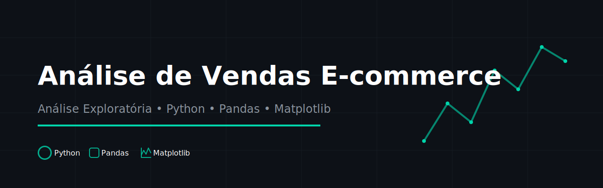
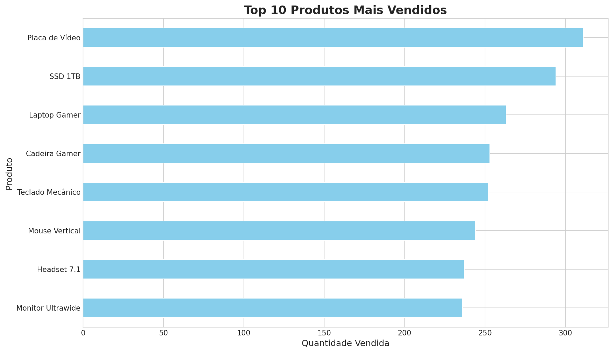
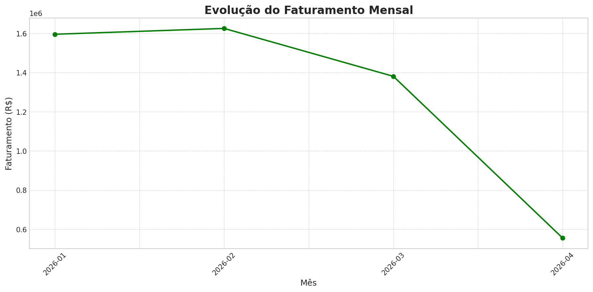
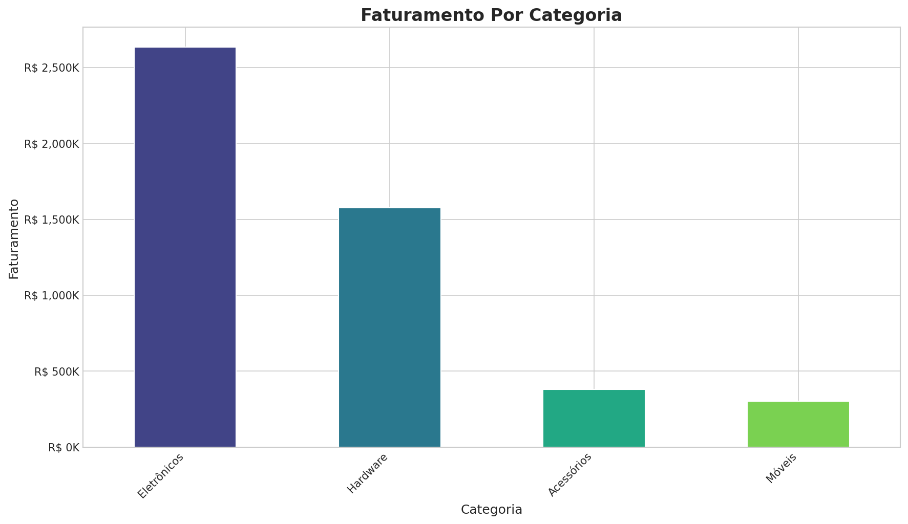
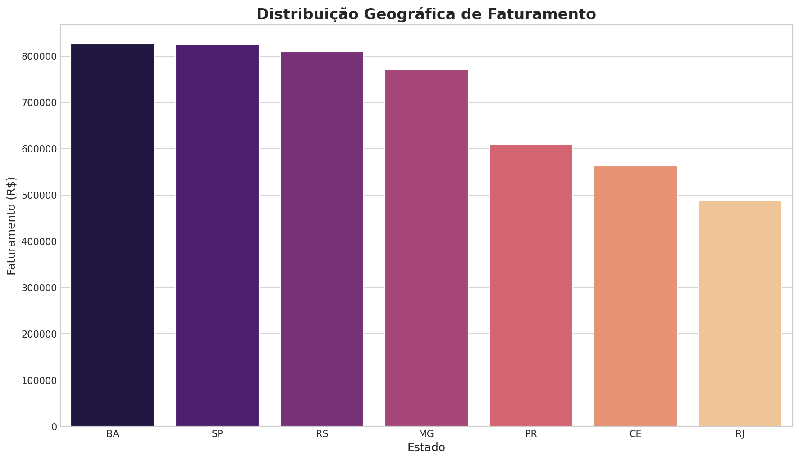

<div align="center">
  
</div>

# 🎯 Maximizando Receita E-commerce: Insights Estratégicos de Vendas

> Análise exploratória profunda para identificar padrões de consumo, sazonalidade e oportunidades de expansão logística.


---

## 🎯 Explore o Projeto
- **Notebook de Análise:** [Analise_Vendas_Ecommerce.ipynb](notebooks/Analise_Vendas_Ecommerce.ipynb)
- **Documentação Relacionada:** [Relatório de Insights (Seção 10)](notebooks/Analise_Vendas_Ecommerce.ipynb#10.-Conclusões-e-Recomendações-de-Negócio)

---

## 📌 Problema de Negócio

Uma loja de e-commerce em crescimento enfrentava baixa visibilidade sobre sua performance real. Sem dados claros, a gestão de estoque era ineficiente, as campanhas de marketing eram genéricas e o planejamento de expansão carecia de fundamentos geográficos. 

O objetivo deste projeto foi transformar o histórico de vendas em **diretrizes estratégicas acionáveis** respondendo: o que vender, quando agir, onde focar e para onde expandir.

## 🔍 Abordagem

1.  **Tratamento de Dados:** Conversão de tipos, limpeza e engenharia de atributos via **Pandas**.
2.  **Análise Temporal:** Identificação de tendências e sazonalidades mensais com **Matplotlib**.
3.  **Análise de Mix:** Decomposição da receita por categoria e volume por produto.
4.  **Geolocalização:** Mapeamento do consumo regional vs. eficiência de entrega com **Seaborn**.

## 📊 Resultados e Descobertas (Principais Insights)

> 💡 **Hero Metric:** Faturamento total de **R$ 5,16 Milhões**, com Ticket Médio de **R$ 3.850,00**, impulsionado pela categoria de Eletrônicos.

### Tabela de Insights de Negócio

| Perspectiva | Descoberta Principal | Recomendação Estratégica |
| :--- | :--- | :--- |
| **Produtos** | **Mouse Sem Fio** e **SSD 1TB** lideram o volume (Top 3 = **34%**). | Priorizar estoque e criar bundles de acessórios high-end. |
| **Sazonalidade** | Pico de demanda em **Fevereiro (R$ 1,63 Mi)** com 15% acima da média. | Antecipar estoques e marketing digital 15 dias antes do pico. |
| **Categorias** | **Eletrônicos** domina **58%** do faturamento total. | Expandir catálogo de Laptops/GPUs para maximizar margem. |
| **Geografia** | O eixo **MG-RJ-SP** concentra **41%** da receita total. | Otimizar logística de entrega expressa no eixo Sudeste. |

## 📈 Visualizações Principais

<div align="center">
  
  <br>
  <em>Figura 1: Volume de vendas por item — periféricos e componentes lideram a demanda (Matplotlib).</em>
</div>

<br>

<div align="center">
  
  <br>
  <em>Figura 2: Evolução temporal — tendência de alta com pico no primeiro trimestre (Matplotlib).</em>
</div>

<br>

<div align="center">
  
  <br>
  <em>Figura 3: Composição da receita — Eletrônicos como motor principal (Matplotlib).</em>
</div>

<br>

<div align="center">
  
  <br>
  <em>Figura 4: Mapa de calor de faturamento — validação da densidade no Sudeste (Seaborn).</em>
</div>

## 🛠️ Stack Tecnológica

*   **Linguagem:** Python 3.10+
*   **Bibliotecas:** Pandas (Data Wrangling), NumPy (Calculus), Matplotlib & Seaborn (Data Viz)
*   **Documentação:** Jupyter Notebook, Shields.io, Markdown

## 📁 Estrutura do Projeto

```text
├── data/               # Datasets gerados e processados
├── notebooks/          # Analise_Vendas_Ecommerce.ipynb
├── reports/            # Figuras exportadas com save_fig()
├── src/                # utils.py (Boilerplate e Styling)
└── requirements.txt    # Dependências do ambiente
```

## 🚀 Como Reproduzir

1.  Clone o repositório.
2.  Instale as dependências: `pip install -r requirements.txt`.
3.  Execute o notebook: `jupyter notebook notebooks/Analise_Vendas_Ecommerce.ipynb`.

---
**Desenvolvido por Athos** - [LinkedIn](https://www.linkedin.com/in/athosroque) | [GitHub](https://github.com/athosroque)
